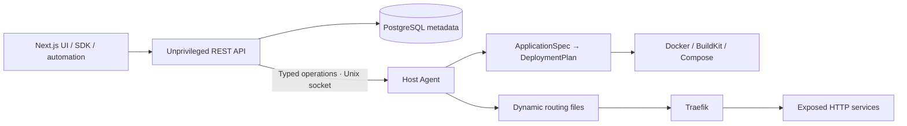

# Hotspark

**Early-stage, experimental self-hosted PaaS for Linux. Not production-ready or a hostile multi-tenant sandbox.**

Hotspark turns a versioned ApplicationSpec into a deployment plan and isolated Docker Compose projects. An unprivileged TypeScript API and Next.js administration UI manage metadata in PostgreSQL. A separate privileged host agent executes a small set of validated operations over a Unix socket. Traefik discovers routes through watched configuration files, without a Docker socket.

Implemented: local administrator login, hashed scoped API tokens, project creation, domain reservations, deployment/start/stop jobs, audit events, digest-pinned images, commit-pinned GitHub builds through BuildKit, PostgreSQL volumes and generated passwords, health-aware routing, a typed SDK, OpenAPI, and a Debian 13 installer.



## Get started

Development requires Node.js 24 and Docker:

```bash
npm ci
make dev
```

Open <http://localhost:3000>. Read the generated development password in `.dev/admin-password`; administrator email is `admin@localhost`. The dev environment starts the control plane and a local database. Use a disposable Debian host for privileged agent testing.

For a fresh Debian 13 amd64/arm64 server, copy this checkout to the server and run:

```bash
sudo env HOTSPARK_SOURCE_DIR="$PWD" sh installer/install.sh
```

The installer builds platform images inside Docker; it does not install host Node.js. There is no public release domain yet. The intended published UX is `curl -fsSL https://example.org/install.sh | sudo sh`; **example.org is a placeholder, not an installation endpoint**. Downloaded releases currently require an explicitly supplied HTTPS release base and trusted SHA-256 checksum. See [installation](docs/installation.md).

```bash
make build
make test
make lint
make typecheck
npm run test:integration
```

## Repository

```text
apps/                 web, api, privileged agent
packages/             application-spec, database, shared, sdk
installer/            Debian bootstrap and platform lifecycle command
deployments/          production Dockerfile/Compose and local database
scripts/              development, release packaging, OpenAPI generation
tests/                unit, schema, API, installer and database integration
docs/                architecture, security, installation, specification, development
```

Read [architecture](docs/architecture.md), [security](docs/security-model.md), [ApplicationSpec](docs/application-spec.md), and [development](docs/development.md). The [OpenAPI document](docs/openapi.json) is generated from the API route definitions.

Before production use: implement worker leases/reconciliation, remote-agent mTLS, backup/restore automation, release signing and prebuilt multi-architecture images, stronger build/network isolation, domain ownership verification, secret rotation, and migration/rollback policies. Automatic updates and multi-user access are intentionally not advertised as complete.

License: [Apache-2.0](LICENSE).
