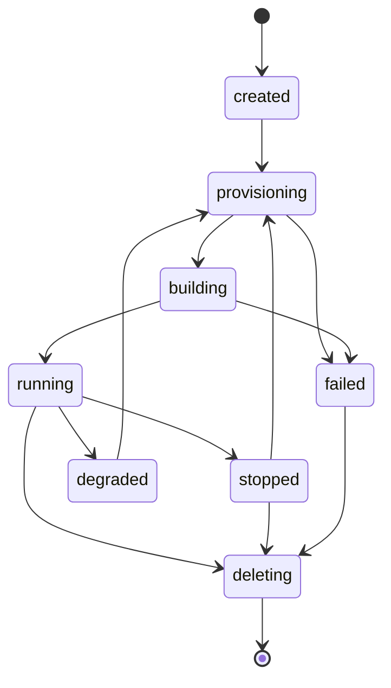

# Application lifecycle

Creation validates intent and atomically stores a project, encrypted user secrets, domain reservations, a deployment snapshot, an audit event and a queued job. HTTP returns 202 with `projectId` and `jobId`. Build work happens outside the request.

`desiredState` is operator intent (`running`, `stopped`, `deleted`); `observedState` records inspection or in-progress work. These are separate from job status. A successful deployment waits for managed service health, runs controlled migrations before application startup, records resolved image IDs, and atomically updates routes and the successful deployment pointer. Failed deployments retain data and diagnostic metadata. Candidates are isolated from the active release. Failed health checks preserve the previous healthy release; database changes are never rolled back. See [deployments](deployments.md), [maintenance](maintenance-mode.md) and [recovery](recovery.md).

## Durable execution

PostgreSQL jobs use row locking with `FOR UPDATE SKIP LOCKED`, 45-second leases and three-second heartbeats. Immutable job payloads contain the spec revision and encrypted secret snapshot. Every project has at most one queued/running job. Progress is persisted as bounded phase events, not raw build output. The local agent serializes mutations across the host; a busy response requeues work without consuming the retry allowance.

The agent journals operation IDs and request hashes on disk. A recovered worker checks this journal before repeating work. Completed results are reused. Transport failures retry up to three attempts with delay; reported deployment failures are terminal. A lease holder must still own the job to finalize its result. Keep one API process and one agent per host in this release; remote placement and distributed scheduling are not implemented.

A migration hook checkpoint is written before invocation. If the agent crashes with an uncertain hook outcome, it refuses automatic replay. Inspect the database's migration state before submitting a new deployment. Hooks are not guaranteed exactly once across a crash. The retry endpoint rejects hook-bearing deployment jobs. Queued jobs can be cancelled before their first attempt. The deployment cancellation endpoint also supports best-effort cancellation during source/build phases; migration and activation cannot be cancelled.

## Lifecycle controls

Start reuses existing images and secrets, stop preserves containers' persistent data, restart restarts the active release without rebuilding, and deploy rebuilds from a new immutable snapshot. PATCH validates and deploys updated specifications. Removing or renaming a PostgreSQL service or changing its major version is rejected: these require a deliberate data migration.

DELETE queues removal, removes routing and containers, then soft-deletes metadata and releases domain reservations. It never passes `--volumes` to Compose. Named volumes, encrypted vaults and deployment history remain for operator recovery. Failed removal keeps the project visible and its domains reserved. Explicit persistent-data deletion and retention automation are outside this API.

## Reconciliation

Every 15 seconds the worker inspects up to 100 projects without active jobs. Stopped/missing/unhealthy containers update observed state. If desired state is running, the known stack is stopped, and `restoreOnDrift` is true, a start job restores it. Desired stopped stacks found running are stopped. Missing deployments and degraded stacks are reported rather than rebuilt automatically; migrations are never invoked by reconciliation. Set `restoreOnDrift:false` before intentional out-of-band stops.

Existing v0.1 projects retain their resource layout and lifecycle operations. They cannot be silently redeployed into v2 generated service names. A reviewed data migration is required before editing these legacy projects.
