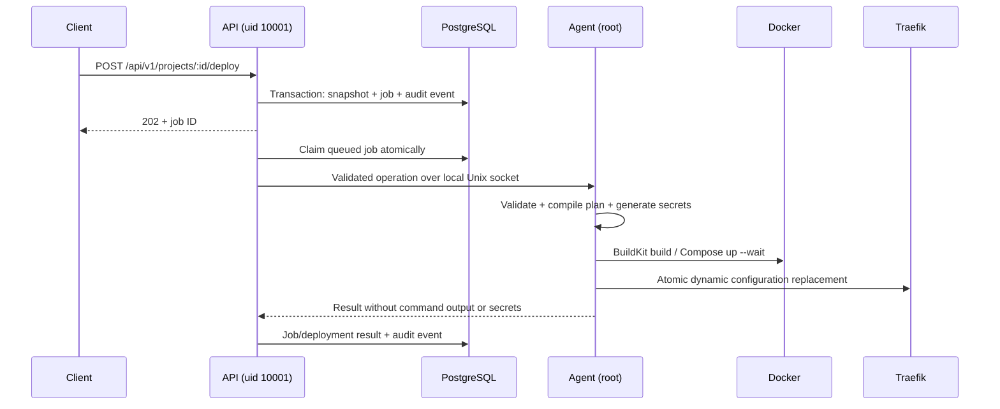

# Architecture

Hotspark is an API-first monorepo. Public requests express application intent; they cannot submit Compose, host paths, Docker flags, arbitrary shell commands, or privileged containers. Shared Zod schemas generate JSON Schema for OpenAPI and are imported by the UI and SDK. The agent independently validates the same intent and compiles its own plan.

## Trust and execution boundaries

The control plane has no Docker socket, host state mount, or root capabilities. The agent's socket is root:10001, mode 0660, inside a root-owned 0750 directory. The API mounts that directory read-only (Unix socket connections still work); the UI has no socket mount. Traefik reads only the routing directory and writes only ACME state.

The authenticated, versioned agent protocol supports deploy/start/stop/restart/remove, runtime inspection, bounded logs, host metrics and operation progress. UUID operation IDs and durable request-hash journals make recovery explicit. See [agent protocol](agent-protocol.md).

## Runtime

Every project uses `hs-<UUID>` as its Compose project, with a separate bridge network and namespaced database volumes. HTTP services with domains additionally join `hotspark-proxy`, with globally unique aliases. Databases never join it. Project networks permit internet egress; they are not Docker `internal` networks. Shared proxy membership allows communication between exposed services; see the security model.

The generated files live under `/var/lib/hotspark/projects/<UUID>`. Plans capture image digests and Git commits. New builds use a dedicated, digest-pinned BuildKit container driver via `docker buildx build --builder hotspark-workloads --load`. Its state/cache belongs to the platform; the older daemon cache is not pruned. The builder is privileged trusted infrastructure, separate from hardened runtime containers. Managed Node/Next/React providers generate reviewed Dockerfile templates around a commit-pinned source context. The legacy `web` provider accepts a repository root Dockerfile. Only final runtime containers receive the platform's resource and privilege restrictions. Build instructions still execute untrusted code; v1 supports trusted administrators, not arbitrary public tenants.

Traefik watches a directory mounted as a directory so atomic file renames are visible. Generated routing files use a `.yaml` extension with JSON syntax (a valid YAML subset); Traefik does not discover `.json` filenames. Routing changes do not restart Traefik. TLS entrypoints and the ACME resolver are configured once by the operator. WebSockets use Traefik's normal HTTP forwarding. HTTP probes run in Traefik every ten seconds. Stopping a project leaves routing in place; unhealthy backends yield HTTP 503, when explicitly stopped. First-class maintenance instead switches the project to a shared HTTP 503 service; see [maintenance](maintenance-mode.md). Managed providers include HTTP health checks; immutable releases additionally probe each declared HTTP service before activation.

## Metadata and jobs

Prisma models cover users, API tokens, projects, services, domains, deployments, jobs, job events, idempotency records and audit events. Global domain uniqueness and per-project advisory locks serialize intent changes. Jobs use PostgreSQL leases and `SKIP LOCKED` claims; the agent journals mutations and refuses unsafe hook replay. A periodic reconciler compares desired and observed runtime state. See [application lifecycle](application-lifecycle.md).

ApplicationSpec is the public, versioned user intent. `packages/providers` compiles a canonical spec into DeploymentPlan v2, with generated internal names, pinned base images and build templates. The agent generates secrets separately, resolves built image IDs, renders Compose and persists inspectable plans. API validation never invokes Docker. UI and SDK share the public schema and API; neither implements provisioning.

Run one API replica and one agent in this release. Recovery is designed for process/host restarts, not multi-host scheduling. Existing v0.1 deployments retain their original layout; editing requires explicit migration to avoid accidentally replacing database volumes.

## Decisions still open

- Release hosting, signing identity, SBOM/provenance and image distribution.
- Remote host identities, mTLS, placement and build isolation.
- Multi-user/project RBAC, quotas and domain ownership verification.
- Build egress/resource budgets and hardened network policy for hostile workloads.
- Key rotation, managed database upgrade/backup/restore and retention automation.
- Distributed traffic activation acknowledgement and richer uncertain-hook operator workflows. Database rollback is intentionally separate from application rollback.
- Custom maintenance pages and certificate status APIs.

Release state is now version 3: stable project infrastructure plus release-specific candidate services, encrypted snapshots and a durable active pointer. See [deployment protocol](deployments.md) and [recovery](recovery.md). Four worker loops retain the single API/agent topology.

## Operational extensions (0.4)

A PostgreSQL-backed SystemTask queue handles backup, cleanup and platform update intent. The API remains unprivileged and sees only results; the agent executes a strict operational union with immutable task IDs and root-owned replay journals. Backups/cleanup share deployment project locks. Updates use an independent runner from the installed agent image so API replacement cannot kill the update process. No public host path, release URL or shell command is accepted. Durable PlatformEvent records feed optional notification adapters. See operations and platform-updates documentation.
