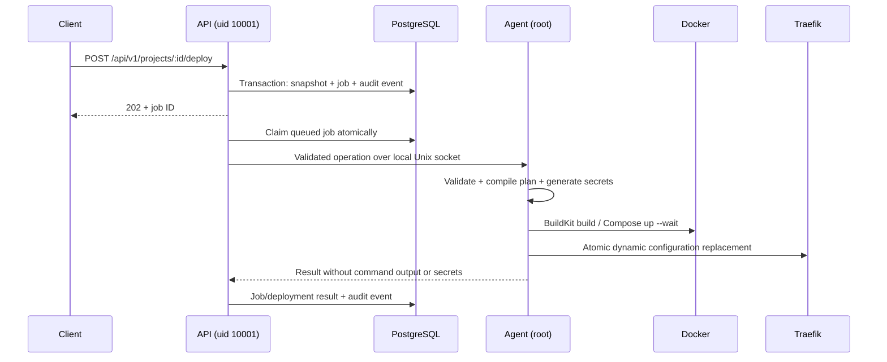

# Architecture

Hotspark is an API-first monorepo. Public requests express application intent; they cannot submit Compose, host paths, Docker flags, arbitrary shell commands, or privileged containers. Shared Zod schemas generate JSON Schema for OpenAPI and are imported by the UI and SDK. The agent independently validates the same intent and compiles its own plan.

## Trust and execution boundaries

The control plane has no Docker socket, host state mount, or root capabilities. The agent's socket is root:10001, mode 0660, inside a root-owned 0750 directory. The API mounts that directory read-only (Unix socket connections still work); the UI has no socket mount. Traefik reads only the routing directory and writes only ACME state.

Only `deploy`, `start`, `stop`, and `inspect` agent operations exist. Operations carry UUID project IDs; deployment requests include an immutable deployment ID and validated spec. Commands use `execFile` with an argument array, fixed executable path, timeout, and output bound. Git source URLs are restricted to public GitHub HTTPS repositories and full commit hashes. No caller-controlled Dockerfile paths, flags, build arguments, host mounts, or shell endpoint exist.

## Runtime

Every project uses `hs-<UUID>` as its Compose project, with a separate bridge network and namespaced database volumes. HTTP services with domains additionally join `hotspark-proxy`, with globally unique aliases. Databases never join it. Project networks permit internet egress; they are not Docker `internal` networks. Shared proxy membership allows communication between exposed services; see the security model.

The generated files live under `/var/lib/hotspark/projects/<UUID>`. Plans capture image digests and Git commits. BuildKit's Docker driver is used via `docker buildx build --load`; its cache is daemon-managed. A Git repository supplies a root Dockerfile. Only final runtime containers receive the platform's resource and privilege restrictions. Build instructions still execute untrusted code; v1 supports trusted administrators, not arbitrary public tenants.

Traefik watches a directory mounted as a directory so atomic file renames are visible. Generated routing files use a `.yaml` extension with JSON syntax (a valid YAML subset); Traefik does not discover `.json` filenames. Routing changes do not restart Traefik. TLS entrypoints and the ACME resolver are configured once by the operator. WebSockets use Traefik's normal HTTP forwarding. HTTP probes run in Traefik every ten seconds. Stopping a project leaves routing in place; unhealthy backends yield HTTP 503, providing a basic maintenance state without a custom maintenance page. Compose readiness for generic HTTP images means container running, unless the image supplies a HEALTHCHECK; routing health is a separate probe and deployment success does not guarantee HTTP readiness.

## Metadata and jobs

Prisma models cover users, API tokens, projects, services, domains, deployments, jobs and audit events. Domain uniqueness is enforced globally by PostgreSQL. Enqueue takes a per-project transactional advisory lock; only one queued/running job is allowed for a project. Job claiming uses a compare-and-set update. One worker executes serially and the agent independently rejects concurrent operations.

**Run one API replica and one agent in v1.** At API startup, previously running jobs are marked failed for manual reconciliation. An agent may have completed a deployment before a control-plane crash; automatic replay would misrepresent that result. There is no distributed transaction across PostgreSQL and Docker. Failed deployments preserve data and may leave a changed or partially started runtime. The current successful plan pointer advances only after Compose succeeds and routes are written. This is not zero-downtime deployment or automatic rollback.

Future hosts can implement the same versioned operation envelope over mutually authenticated TLS. Before enabling them, add host identities, placement, capabilities, per-host durable leases, operation IDs and reconciliation. Do not expose the local socket protocol on TCP without these changes.

## Decisions still open

- Release hosting, signing identity, SBOM/provenance verification and image distribution.
- Remote worker authentication, leases, cancellation and crash reconciliation.
- Multi-user/project RBAC, quotas and verified domain ownership. Existing role fields are a foundation, not tenant authorization.
- Build egress policy, dedicated BuildKit workers and resource budgets for builds.
- User secret delivery/rotation, managed database connection adapters and backup/restore.
- Application spec updates, retention, blue/green rollout and database-aware rollback.
- Custom maintenance pages, certificate status APIs and automatic TLS configuration.
