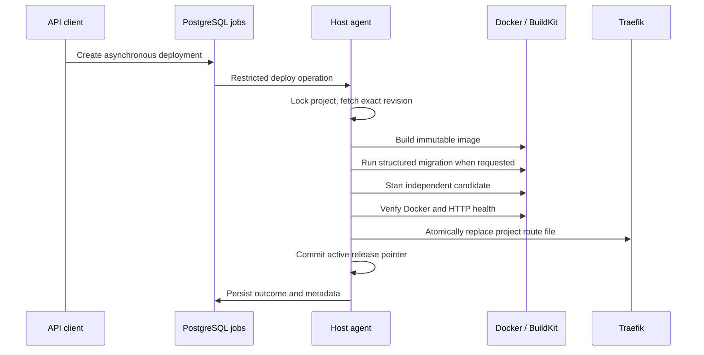

# Immutable deployments (0.3, early stage)

ApplicationSpec → versioned DeploymentPlan → BuildKit image → candidate Compose services → health verification → atomic Traefik file → durable active-release pointer. The latest attempt and `Project.activeDeploymentId` are distinct. Runtime containers never fetch source or install dependencies during restart.

GitHub HTTPS repositories support an exact commit, branch, or tag. Each attempt fetches into a fresh project/operation workspace and resolves a 40-character commit before building. A supplied commit takes precedence over its descriptive branch. Fetches are shallow; submodules, escaping symlinks, special files and contexts exceeding 256 MiB/100,000 entries are rejected. Git object growth is limited to 512 MiB, sampled every second. Workspaces are cleaned on completion and recovery. `.env`, `.env.*`, `.git` and `node_modules` are excluded. Never commit credentials: arbitrary other repository files are not classified as secrets.

BuildKit uses its local cache and a 14-minute command timeout. Generated multistage templates produce non-root Node/Next runtimes and a production static server for React. Next standalone projects must configure `output: 'standalone'`. The separate migration target includes Prisma tooling. Only runtime containers and migration jobs receive generated secret files; no application secrets are passed as build arguments. Repository build scripts are executable code; only trusted project authors should receive deployment permissions.

Every workload image is selected by its immutable local SHA-256 image ID. Metadata retains its unique deployment tag, resolved source, actor/token, predecessor and rollback target. Local image IDs are not registry manifest digests; registry push/signing/remote-host distribution remains future work. Images and deployment metadata are retained; there is no automatic image garbage collection yet.

Only web services with explicit domains join `hotspark-proxy`. Release-specific service aliases prevent old/new collisions. The project private bridge, PostgreSQL service name and volume are stable across releases. The previous release remains available while the candidate builds and starts; current and previous containers are retained after success, so capacity must accommodate both. Older inactive containers are removed without deleting database volumes.

Health verification requires a running container, healthy Docker status when configured, and an HTTP success response for HTTP workloads. Configure `runtime.healthcheck` with `type: http`, `path`, `intervalSeconds`, `timeoutSeconds`, and `retries`. Default checks use the service health path. Custom Dockerfile applications must provide an HTTP runtime compatible with their declared port. Traffic updates use Traefik's watched file provider; no proxy restart is needed. The file replacement is atomic, while Traefik applies it asynchronously; this is not a distributed transaction or a zero-downtime guarantee.

Start reuses the active image, stop retains metadata and data, restart reuses the active image, deploy creates a new release, and rollback creates a new release referencing a retained image. A stopped project can be deployed explicitly. A project without a successfully activated release cannot be started as if it had one.

Release logs are redacted and capped at 1 MiB per release, with at most 256 KiB returned per request. The latest 20 releases' logs are retained for up to 14 days; pruning runs during deployment/recovery. Each disk release journal retains up to 200 events. PostgreSQL job events older than 30 days are pruned. Image and release metadata retention is deliberately separate from log retention.

Run `bash tests/releases.integration.sh --disposable-host` on an installed disposable host. This operator harness uses a local Git transport fixture with the real fetcher, BuildKit, Docker, API service layer, PostgreSQL and Traefik. Production accepts no local Git transport override.
