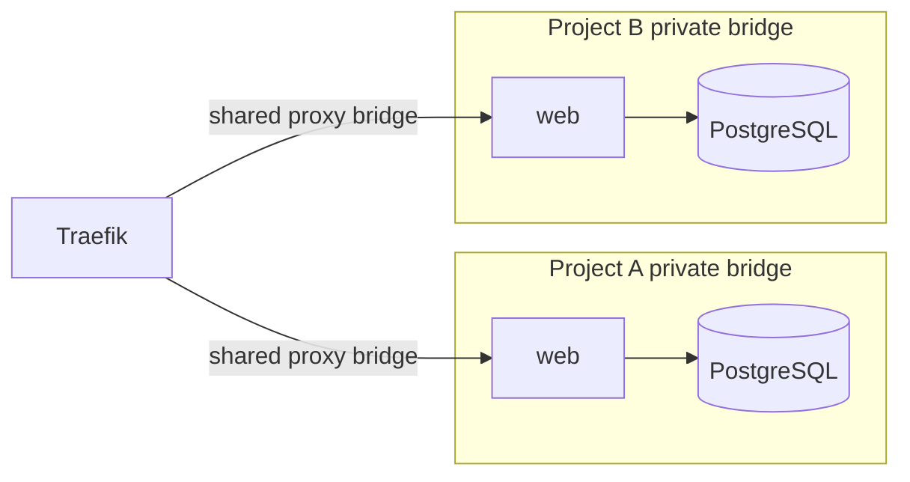

# Network isolation

Every project has a random UUID and deterministic Compose project `hs-<UUID>`. Service IDs are derived from SHA-256 of the project UUID and validated service name; user display names never become Docker project identifiers. Database/user names, network aliases and volume names are generated from these identifiers.

Private bridges are distinct. PostgreSQL attaches only to its project's private bridge, has a project-specific named volume, and never publishes a port. Only HTTP services with explicit domains attach to `hotspark-proxy`. Internal services have no proxy membership or host port mappings. Bridge networks allow normal outbound access; `private` does not mean Docker's `internal:true` network option.

A shared proxy bridge permits exposed services to reach one another on that bridge. Docker bridge isolation is not an egress firewall and does not block reachable host services. Hostile-tenant isolation requires additional network enforcement or separate workers/VMs; do not interpret this topology as that guarantee.

Domain names normalize to lowercase, validate as DNS hostnames and have a global database uniqueness constraint. Updates reserve both old and new domains until deployment succeeds; removal releases names only after routes are removed. This avoids reassignment during failed jobs. Ownership verification is not implemented; only trusted administrators may manage domains.

The agent atomically replaces watched Traefik `.yaml` files (JSON syntax is valid YAML). Normal route changes need no restart. Multiple domains, WebSockets and HTTP health probes are supported. Unhealthy/stopped backends yield 503; there is no custom maintenance page. HTTPS requires initial ACME configuration, real DNS and reachable ports 80/443; see installation.

Host capacity also depends on Docker address pools. Repeated disposable project creation exhausted the default pools during testing; removing old test networks restored capacity without deleting volumes. Production operators must plan sufficient non-overlapping bridge address space. Hotspark does not silently rewrite an existing daemon network configuration.
