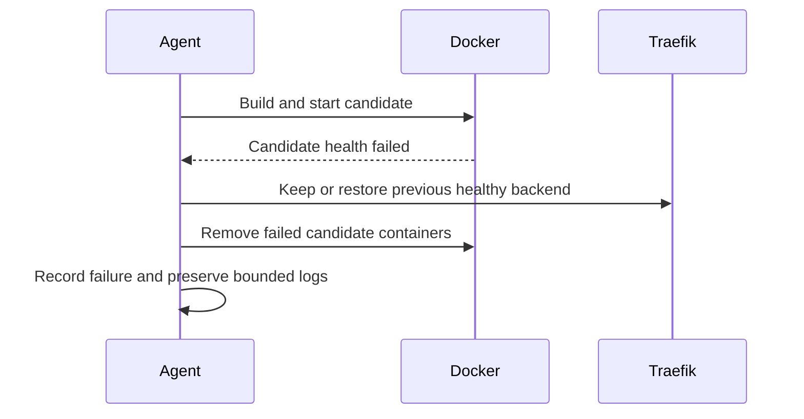
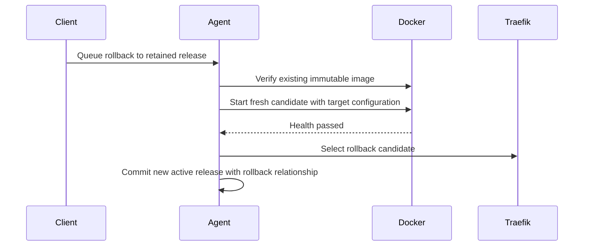

# Application rollback

`POST /api/v1/projects/:id/rollbacks` with `{"deploymentId":"<successful-release-uuid>"}` queues a new deployment. The target must belong to the project and retain a successful immutable image. Rollback verifies the image, restores the target's resolved specification and encrypted secret snapshot, starts a new candidate, checks health, and switches routing. It does not rebuild source or rerun migration hooks. The new record has `rollbackOfId`; the displaced release becomes `rolled_back`. The active deployment is the new rollback record, not the historical target ID.

**Application rollback is not database rollback.** Database credentials, network and persistent volume remain stable. Destructive migrations may make an earlier application incompatible. Test backward-compatible expand/contract migrations and keep separately tested backups.

Failed candidate cleanup never removes the PostgreSQL volume. If the previous release is itself unhealthy, maintenance remains on. Legacy 0.2 active workloads are imported for continuity; historical 0.2 builds do not become complete 0.3 rollback snapshots retroactively. Do not delete retained images if you need those rollback targets.
